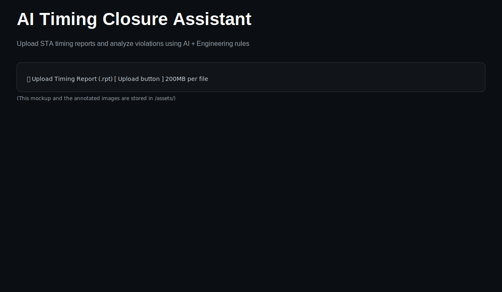
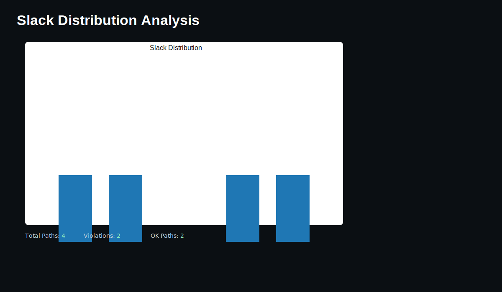
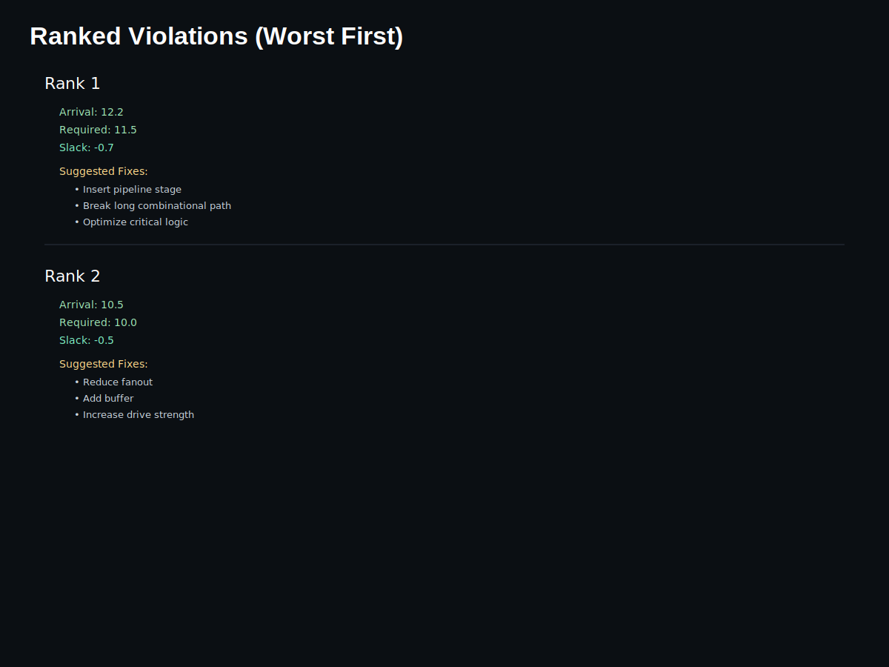
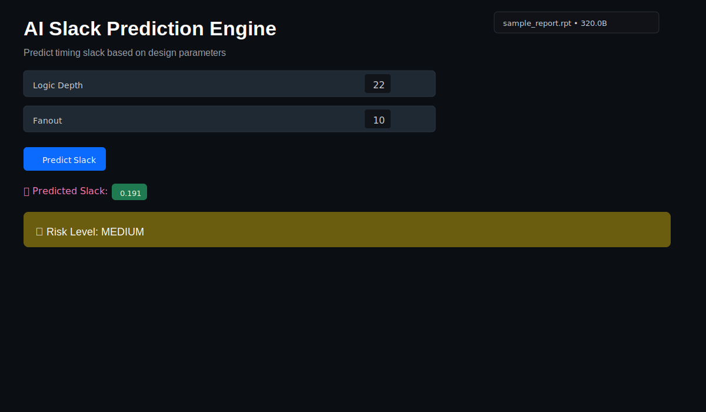

# AI Timing Closure Assistant

## Description

AI Timing Closure Assistant is a lightweight EDA-inspired tool for analyzing Static Timing Analysis (STA) reports. The tool parses .rpt timing reports, detects timing violations (negative slack), ranks the worst paths, suggests engineering fixes via a rule-based recommender, and offers a simple ML model to predict slack from design parameters.

A Streamlit dashboard provides an interactive UI to upload reports, inspect slack distributions, review ranked violations with suggested fixes, and run AI predictions.

## Features

- STA report parsing (arrival, required, slack extraction)
- Violation detection and ranking (worst slack first)
- Rule-based recommendation engine for fixes
- ML-based slack prediction using RandomForestRegressor (synthetic data)
- Streamlit dashboard with tabs for analysis, violations, and AI predictions

## Tech Stack

- Python
- Streamlit
- Pandas
- NumPy
- Scikit-learn
- Matplotlib

## Project Structure

AI-Timing-Closure-Assistant/

- parser.py        - Parse .rpt timing reports into path records
- analyzer.py      - Detect violations and sort worst-first
- recommender.py   - Rule-based fix suggestions
- ml_model.py      - Trains RandomForestRegressor on synthetic data and predicts slack
- app.py           - Streamlit application (Dashboard)
- sample_report.rpt - Example timing report to try the app
- requirements.txt - Python dependencies
- README.md        - This file
- assets/          - UI screenshots and annotated mockups

## Screenshots

Below are screenshots of the Streamlit dashboard demonstrating the key views.

### App hero / Upload area



*Upload area and header for the AI Timing Closure Assistant.*

### Slack Distribution (Timing Analysis)



*Matplotlib histogram showing distribution of path slacks and summary metrics.*

### Ranked Violations (Worst First)



*Ranked list of violating paths (most negative slack first) with suggested fixes.*

### AI Slack Prediction Engine



*Interactive prediction UI: logic depth, fanout inputs, predicted slack, and risk level.*

## How to Run

1. Create a Python virtual environment (recommended):

```bash
python -m venv venv
source venv/bin/activate   # macOS/Linux
venv\Scripts\activate      # Windows
```

2. Install dependencies:

```bash
pip install -r requirements.txt
```

3. Run the Streamlit app:

```bash
streamlit run app.py
```

4. Upload a `.rpt` file or use the included `sample_report.rpt` to try the dashboard.

## Project Flow

Timing Report (.rpt) → parser.py → analyzer.py → recommender.py → ml_model.py → app.py (Streamlit UI)

## Future Improvements

- Integrate with real EDA STA tools (OpenSTA) for richer parsing
- Improve ML model using real labeled timing datasets and feature engineering
- Add per-path metadata (startpoint/endpoint names, path type) and filtering
- Export reports and suggested fixes in CSV/Excel formats

## License

This project is provided as-is for educational/demo purposes.
